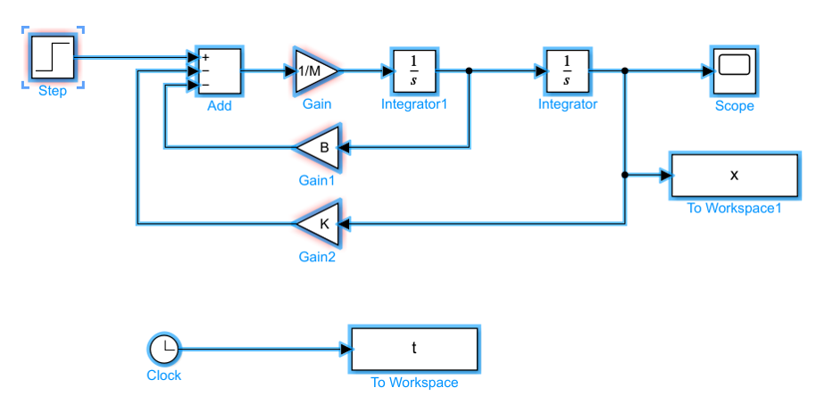
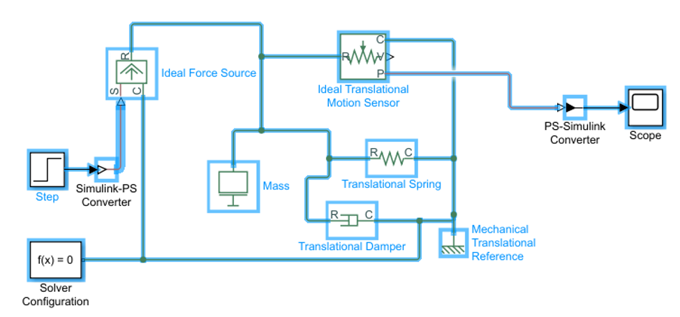

# MECH370
Useful information for Concordia Course MECH370

## Lab report
[Example file](./report_example.pdf) 

## Lab 1
Why does $\frac{1}{s}$ represent the integrator? According to the Laplace transform of integral:

$$
\mathscr{L}\left\{\int g(t) d t\right\}=\int_0^{+\infty}\int g(t)dt e^{-st}dt = 
\frac{G(s)+\left[\int g(t) d t\right]_{t=0}}{s}
$$

where $G(s) = \mathscr{L}[g(t)]$

Simulink model with block labels

Simscape model with block labels

