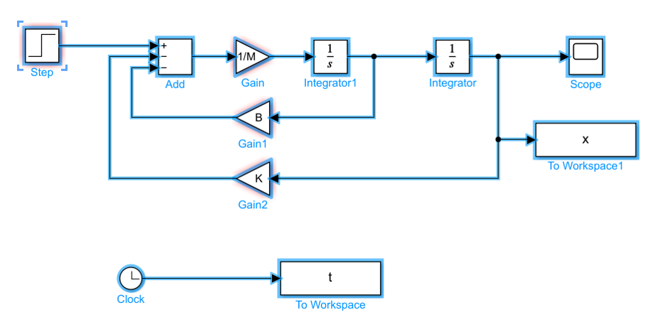

## Lab1 Slides can be found [here](documents/lab1_slides.pdf)

## If you encounter the following error:


It is because the file name of script file is the same as the name of the model file. Changing the name of the script file to something different can solve the problem.

## Why does $\frac{1}{s}$ represent the integrator? According to the Laplace transform of integral:

$$
\mathscr{L}[\int g(t) d t]=\int_0^{+\infty}\int g(t)dt e^{-st}dt = 
\frac{G(s)+[\int g(t) d t]_{t=0}}{s}
$$

where $G(s) = \mathscr{L}[g(t)]$

## Simulink model with block labels


You can find more information [here](documents/more_instructions_on_lab_1_1.pdf).

## Matlab code running Simulink model
```Matlab
M=2;
K=16;
B=4;
fafinal = 8;
sim('lab1_simulink_model')
plot(t,x);
hold on
B=8; sim('lab1_simulink_model');plot(t,x)
B=12; sim('lab1_simulink_model');plot(t,x)
B=25; sim('lab1_simulink_model');plot(t,x)
legend('B=4','B=8','B=12','B=25');
hold off
```

You can find more information [here](documents/more_instructions_on_lab_1_1.pdf).

## Matlab code for simulation
```Matlab
M=2;
K=16;
B=4
numeratorM=1;
denominatorM=[M 0];
sysM=tf(numeratorM,denominatorM) 
numeratorI=1;
denominatorI=[1 0];
sysI=tf(numeratorI,denominatorI)
sysMD=feedback(sysM,B)
sysMDS=feedback(series(sysMD,sysI),K)
subplot(1,2,1)
step(sysMDS,10)
subplot(1,2,2)
bode(sysMDS)
```
Detailed explanation:

The code "numeratorM=1;denominatorM=[M 0];sysM=tf(numeratorM,denominatorM)" builds the following blocks:


The code "sysMD=feedback(sysM,B)" builds the following blocks:


The code "numeratorI=1;denominatorI=[1 0];sysI=tf(numeratorI,denominatorI)" builds the second integrator block.

Finally, the code "sysMDS=feedback(series(sysMD,sysI),K)" builds the complete system.

## Simscape model with block labels

