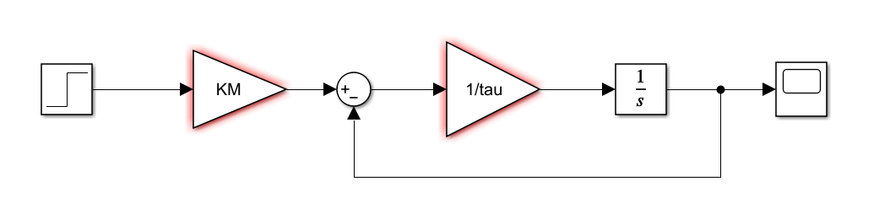

## Simulink model


## How to calculate angular velocities according to the tachometer voltages.
```math
V_{tacho}= K_t * \omega
```

where $K_t$ is the tachometer sensitivity
```math
K_t = 2 (V / krpm)
```

where $krpm$ represents 1000 rounds per minute, so
```math
1 krpm = 1000 * 2\pi /60 = 104.72 (rad/second)
```

so, 
```math
K_t = 0.019 (V/(rad/second))
```

Therefore, if $V_{out}$ is 3V, then
```math
V_{tacho} = V_{out} = 3V \\
\omega = V_{tacho} / K_t = 157.89 (rad/second)
```